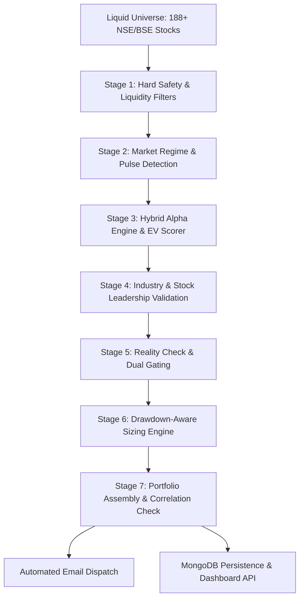

# 📈 STALKER — Institutional-Grade Algorithmic Screener & Alpha Engine

[](https://www.python.org/)
[](https://opensource.org/licenses/MIT)
[]()
[](https://fastapi.tiangolo.com/)

> **STALKER** is an automated quantitative screening and portfolio construction system designed for the Indian equity markets (NSE & BSE). It evaluates a liquid universe of 188+ stocks across multi-stage quantitative filters, dynamic market regime models, volatility clustering, and leadership metrics to generate high-conviction swing and momentum setups.

---

## ⚡ Key Highlights & Core Capabilities

- **7-Stage Gated Pipeline**: Multi-phase pipeline filtering out overnight gap risk, illiquidity, and abnormal volatility spikes before alpha scoring.
- **Dynamic Market Regime Engine**: Classifies market context (Trend-Day, Compression, Volatile Reversal, Expansion) using Nifty benchmark breadth and volatility models.
- **Hybrid Alpha & Expected Value (EV) Model**: Combines momentum, relative strength (RS rating vs Nifty 50), Minervini trend template, and VCP (Volatility Contraction Pattern) metrics.
- **Adaptive Portfolio Construction**: Drawdown-aware risk sizing, position weighting, and risk-reward optimization.
- **Automated Operations**: Scheduled morning scans (7:00 AM IST), real-time price verification, automated email dispatches to subscribers, and end-of-day attribution audits.
- **Real-Time Interactive Dashboard**: Web UI and FastAPI backend for live trade logs, historical backtests, and mistake audits.

---

## 🏗️ Architecture Overview



### Daily Pipeline Schedule (IST)
| Time (IST) | Module | Purpose |
|---|---|---|
| **07:00 AM** | `screener.py` / `main.py` | Full universe historical scan, technical ranking, and candidate selection. |
| **08:15 AM** | `main.py` | Live price cross-check against pre-market quotes to eliminate gap drift. |
| **08:30 AM** | `main.py` | Automated subscriber email dispatch with actionable setups and stop-losses. |
| **09:20 AM** | `main.py` | Market open price recording and execution logging. |
| **03:35 PM** | `main.py` | Market close print recording for active trade tracking. |
| **04:00 PM** | `generate_mistakes_audit.py` | Daily EOD P&L audit, setup expectancy calculation, and admin attribution report. |

---

## 🛠️ Tech Stack

| Layer | Technologies |
|---|---|
| **Language & Runtime** | Python 3.10+ |
| **Quantitative & Analysis** | `pandas`, `numpy`, `scipy`, `yfinance`, Technical Indicators (`TA-Lib` equivalents) |
| **Backend & API** | FastAPI, Uvicorn, REST Endpoints |
| **Database & Cache** | MongoDB / PyMongo, Local JSON cache |
| **Notifications & Reporting**| SMTPLib / Gmail API, ReportLab / PDF Generator |
| **Frontend Dashboard** | HTML5, CSS3, Modern ES6+ JavaScript, Responsive Charts |

---

## 🚀 Getting Started

### 1. Prerequisites
- Python 3.10+
- MongoDB installed and running locally or URI string
- Valid Gmail SMTP credentials for notifications

### 2. Installation
```bash
# Clone the repository
git clone https://github.com/Harshxu/stalker.git
cd stalker

# Create and activate virtual environment
python -m venv venv
# On Windows:
venv\Scripts\activate
# On Linux/macOS:
source venv/bin/activate

# Install dependencies
pip install -r requirements.txt
```

### 3. Configuration
Create a `.env` file based on `.env.example`:
```env
MONGO_URI=mongodb://localhost:27017
DB_NAME=stalker_db
SMTP_EMAIL=your_email@gmail.com
SMTP_PASSWORD=your_app_password
ADMIN_EMAIL=your_admin_email@gmail.com
```

### 4. Running the Engine
```bash
# Run morning screening cycle
python main.py --mode run

# Launch the FastAPI server & dashboard
python api_server.py
```
