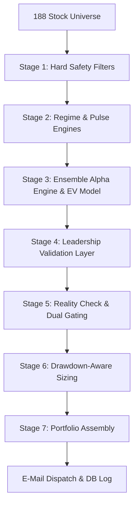

# STALKER — System Architecture & Complete Screening Process
*A Technical and Quantitative Guide to the STALKER Algorithmic Stock Screener*

---

## 1. System Overview

STALKER is an automated, institutional-grade quantitative screening and portfolio construction system designed for the Indian stock market (NSE & BSE). The system executes a daily multi-stage pipeline to process a universe of **188 liquid symbols**, analyze market context, rank stocks based on a hybrid Alpha-Expected Value model, validate them through a Leadership layer, perform risk management, and assemble a correlation-optimized portfolio.

---

## 2. Daily Execution Workflow

The STALKER scheduler operates on a strict daily timeline designed around the Indian market sessions (IST). Each step corresponds to a specific module or execution mode in `main.py`.

| Time (IST) | Module / Script | Action |
|------------|-----------------|--------|
| **7:00 AM** | `main.py --mode run` | **Morning Scan**: Executes `screener.run_screen()`. Performs data fetching, safety filtering, scoring, leadership validation, and writes results to MongoDB and local JSON (`latest_scan.json`). |
| **8:15 AM** | `main.py` | **Price Verification**: Cross-checks entry prices against fresh live `yfinance` quotes, auto-correcting any drifted values in memory before the market opens. |
| **8:30 AM** | `main.py` | **Morning Email Dispatch**: Dispatches the morning email to subscribers. If zero buys pass the safety gates, sends a capital-preservation watchlist email instead of aborting. |
| **9:20 AM** | `main.py` | **Opening Print Recording**: Records the actual opening prices of Nifty and candidates to lock in entry cost bases. |
| **3:35 PM** | `main.py` | **Closing Print Recording**: Records the daily closing prices for active performance tracking. |
| **4:00 PM** | `generate_mistakes_audit.py` | **EOD Report & Audit**: Calculates EOD P&L, audits setup expectancies, updates the attribution database, and sends EOD private diagnostic audits to the administrator. |

---

## 3. Step-by-Step Screening Pipeline

### Step 1 — Data Fetching & Prep Pipeline
Before checks run, the data fetcher (`data_fetcher.py`) performs a two-pass chunked parallel download of historical data using `yfinance` to avoid rate limits and memory leaks:
* **Pass 1 (3-Month Daily Data)**: Loaded for all universe stocks to calculate short-term technicals, ATR, and VCP.
* **Pass 2 (1-Year Daily Data)**: Loaded selectively for stocks that pass initial filters to evaluate long-term moving averages, Minervini trend template conditions, and trend stability scores.

---

### Step 2 — Stage 1: Hard Safety Filters (The Gatekeepers)
Stocks must pass every single gate below in `screener.py` to become candidates:

1. **Liquidity Gate (`evaluate_liquidity`)**: 
   * Computes the 20-day average volume and daily traded value:
     $$\text{Daily Turnover} = \text{Average Volume (20d)} \times \text{Latest Close}$$
   * **Threshold**: Must exceed `config.MIN_DAILY_TURNOVER` (₹10 Crore/day or 100,000,000 INR).
2. **Overnight Gap-Risk Filter (`check_overnight_gap_risk`)**:
   * Evaluates historical gap sizes over the last 20 trading days: 
     $$\text{Gap}\% = \left|\frac{\text{Open}_t - \text{Close}_{t-1}}{\text{Close}_{t-1}}\right| \times 100$$
   * **Rejection**: Fails if $\text{Gap}\% > 3.0\%$ on more than 5 of the past 20 trading days.
3. **ATR Volatility Spike Filter (`check_atr_spike_risk`)**:
   * **Rejection**: Rejects any stock whose latest ATR(14) is $> 2.0\times$ its 20-day average ATR. This filters out stocks undergoing erratic, non-structural volatility shocks.
4. **Circuit-Lock Filter (`check_circuit_lock`)**:
   * **Rejection**: Rejects if High == Low (locked in circuit) or daily volume is $< 5000$ shares and $< 5\%$ of its 20-day average volume.
5. **Calibrated Risk Gating (`evaluate_risk_profile`)**:
   * Computes a standardized 0–10 risk score combining ATR volatility and 60-day maximum drawdown:
     $$\text{Risk Score} = (\text{ATR}\% \times 150) + (\text{Max Drawdown}\% \times 15)$$
     where:
     - $\text{ATR}\% = \frac{\text{Latest ATR}(14)}{\text{Latest Close}}$
     - $\text{Max Drawdown}\% = \text{Max drawdown over the last 60 trading days}$
   * **Dynamic Gating Threshold**:
     * *Bear / Deteriorating Regime*: Max allowed Risk Score = **`5.2`**
     * *Neutral / Sideways / Improving Regime*: Max allowed Risk Score = **`6.2`**
     * *Bull Regime*: Max allowed Risk Score = **`7.2`**
6. **Data Quality Gate (`calculate_data_quality`)**:
   * Scores data freshness and completeness. Rejects if score is $< 70.0$ or if critical fundamental fields (ROE, Debt/Equity, Revenue Growth) are missing.
7. **Downtrend Rejection (`detect_market_structure`)**:
   * Runs swing detection and moving average structures. Instantly rejects if the stock is in a confirmed `downtrend`.

---

### Step 3 — Stage 2: Regime Classifier & Market Pulse

1. **Regime Engine (`regime_engine.py`)**:
   * Classifies the market into one of **8 states** using Nifty 50 position relative to EMA50 and EMA200, Nifty 20d annualized realized volatility, EMA20 slope, and universe market breadth (% stocks above 50 and 200 EMA):
     * **Bull_Trend**: Nifty Close > EMA50 and Nifty Close > EMA200 (normal volatility and breadth).
     * **Bull_Expansion**: Close > EMA50 and Close > EMA200, Market Breadth (50 EMA) >= 60%, Breadth rising, and EMA20 slope > 0.05.
     * **Bull_Exhaustion**: Close > EMA50 and Close > EMA200, Realized Volatility > 22.0%, and Market Breadth (50 EMA) < 40%.
     * **Bear_Trend**: Close < EMA200 (normal conditions).
     * **Bear_Panic**: Close < EMA200, Realized Volatility > 35.0%, and Advance/Decline ratio < 0.5 (capitulation).
     * **Bear_Recovery**: Close < EMA200, Market Breadth (50 EMA) rising, Advance/Decline ratio > 1.2, and EMA20 slope > 0.0.
     * **Neutral_Compression**: Between EMA50 and EMA200, Realized Volatility <= 22.0%, |EMA20 slope| < 0.05, and breadth not rising.
     * **Neutral_Rotation**: Between EMA50 and EMA200 (not compression).
   * **Buying Permission**: Buys are suppressed entirely if the regime is `Bear_Trend` or `Bear_Panic`.
2. **Market Pulse Engine (`market_pulse.py`)**:
   * Computes a daily buyer-vs-seller pressure metric (0–100) combining India VIX, universe Advance/Decline ratio, closing range positioning, and Chaikin Money Flow.
   * **Pulse Gate**: If Pulse Score is $< 35$, all BUY picks are automatically downgraded to WATCH due to extreme selling pressure.
3. **Sector RS Momentum**:
   * Computes relative performance of sectors vs Nifty over a 20-day window:
     $$\text{Sector RS} = \text{Sector 20d Return}\% - \text{Nifty 50 20d Return}\%$$
   * Stage 1 survivors in the top 25% highest-performing sectors and industries are flagged as `leading_sectors` and `leading_industries`.

---

### Step 4 — Stage 3: Ensemble Alpha Engine & EV Model

1. **Alpha Scoring Sub-Models**:
   * **Momentum Sub-Model**: Uses relative strength percentile vs Nifty, EMA alignment, and RSI positioning (using a Gaussian curve centered at 60).
   * **Quality Sub-Model**: Uses capital efficiency (ROE) and growth stability.
   * **Institutional Sub-Model**: Uses volume ratio surges (relative to 20-day average) and Chaikin Money Flow.
   * **Catalyst Sub-Model**: Uses analyst earnings surprises and EPS growth acceleration.
2. **Ensemble Weights Matrix**:
   * The sub-model scores are combined using weights dynamically adapted to the 8 market regimes:
     | Regime | Momentum | Quality | Institutional | Catalyst |
     |--------|----------|---------|---------------|----------|
     | **Bull_Trend** | 40% | 20% | 25% | 15% |
     | **Bull_Expansion** | 45% | 15% | 25% | 15% |
     | **Bull_Exhaustion** | 20% | 35% | 30% | 15% |
     | **Neutral_Rotation** | 25% | 30% | 25% | 20% |
     | **Neutral_Compression** | 20% | 35% | 25% | 20% |
     | **Bear_Trend** | 10% | 45% | 30% | 15% |
     | **Bear_Panic** | 05% | 50% | 35% | 10% |
     | **Bear_Recovery** | 25% | 35% | 25% | 15% |
3. **Meta Model Adjustment (`meta_model.py`)**:
   * Classifies setup/trade types into `BREAKOUT`, `PULLBACK`, `MOMENTUM`, `VALUE_MOMENTUM`, or `EARNINGS_RUNNER` and adjusts raw alpha scores.
4. **Expected Value (EV) Hybrid Model**:
   * Blends the adjusted Alpha score with setup Expectancy:
     $$\text{Expectancy} = (\text{Win Rate} \times \text{Avg Win}) - (\text{Loss Rate} \times \text{Avg Loss})$$
     $$\text{EV Score} = \min(100.0, \max(0.0, 50.0 + \text{Expectancy} \times 10))$$
     $$\text{Final Score} = \text{Alpha Weight} \times \text{Meta Alpha} + \text{EV Weight} \times \text{EV Score}$$
     where:
     - $\text{EV Weight} = 0.30 \times \text{EV Confidence}$
     - $\text{EV Confidence} = \min(1.0, \frac{\text{Sample Size}}{30})$
     - $\text{Alpha Weight} = 1.0 - \text{EV Weight}$
5. **Regime Penalties**:
   * Non-defensive sectors (e.g. IT, Banking) receive a flat **`-15.0` point penalty** in Bear legacy markets.
   * Capped total penalty of `-30.0` points for debt/equity > 1.2 (-10), ATR% > 6% (-10), and missing earnings (-5).
6. **Momentum Leadership Boost**:
   * Adds a **`+7.5` point boost** if the stock has RS rank $\ge 75\%$ and belongs to a leading sector or leading industry.

---

### Step 5 — Stage 4: Leadership Validation Layer (Elite Qualification)

Candidates are validated through `leadership_engine.py` to identify true institutional leading structures:

1. **Mark Minervini Trend Template (8 Conditions)**:
   * Condition 1: Latest Close > 150-day SMA and Close > 200-day SMA (Non-negotiable).
   * Condition 2: 150-day SMA > 200-day SMA (Non-negotiable).
   * Condition 3: 200-day SMA is trending up for at least 1 month (22 trading days).
   * Condition 4: 50-day SMA > 150-day SMA and 50-day SMA > 200-day SMA.
   * Condition 5: Latest Close > 50-day SMA (Non-negotiable).
   * Condition 6: Close >= 1.30 * 52-week Low (Non-negotiable).
   * Condition 7: Close >= 0.75 * 52-week High (within 25% of 52w high).
   * Condition 8: Relative Strength (RS) Rank >= 70.0.
   * **Rejection Gate**: Rejects if conditions passed is less than `config.MINERVINI_MIN_CONDITIONS` (relaxed to **`5/8`**) or if any non-negotiable condition fails.
2. **Volatility Contraction Pattern (VCP) Detection**:
   * Programmatically detects consolidations: contracts (2–4 troughs), shrinking pullback depth, ATR contraction (ATR 10 < ATR 20), tight closes, and volume tapering.
   * **VCP Scoring (0-100)**:
     - Price close to 60-day high (within 12%): +20 points.
     - ATR Compression (ATR 10 < ATR 20): +20 points.
     - Tight Closes (max spread < 2.5% over 5 days): +15 points.
     - Volume Tapering (10d avg volume < prior 20d avg): +15 points.
     - Contractions count: 2 contractions (+15 points), 3+ contractions (+30 points).
     - Shrinking contraction depth: +10 points.
   - **Grades**: *Elite* (Score >= 80), *Strong* (60-79), *Weak* (40-59), *None* (< 40). Fails validation if VCP score is $< 40.0$.
3. **Leadership Stability Score**:
   * Measures the percentage of the last 60 days that the stock has traded in a healthy structure: Close > 150 SMA and 50 SMA > 150 SMA.
4. **Leadership Score**:
   * Unified score:
     $$\text{Leadership Score} = (\text{Stability Score} \times 0.35) + (\text{Sector RS} \times 0.25) + (\text{Industry RS} \times 0.20) + (\text{Market Bull Bonus} \times 0.10) + (\text{Inst Score} \times 0.10)$$
     where *Market Bull Bonus* = 100 if Nifty is bullish, else 0.
5. **Final Multipliers**:
   * Gearing applied to Alpha rankings:
     $$\text{Final Score} = \text{Alpha Score} \times \text{Leadership Multiplier} \times \text{VCP Multiplier}$$
     * *VCP Multipliers*: Elite (1.07x), Strong (1.04x), Weak (1.02x), None (1.00x).
     * *Leadership Multipliers*: Elite (1.05x), Strong (1.02x), Acceptable (1.00x), Low (0.95x).

---

### Step 6 — Stage 5: Reality Check & Dual Gating

1. **Friction Checks (`reality_check.py`)**:
   * Downgrades BUY to WATCH if:
     - **Gap Extension**: Opening gap exceeds 5%.
     - **Earnings Proximity**: Earnings event within 3 days.
     - **Circuit Proximity**: Close within 1% of 52-week high (circuit proxy).
     - **Minimum Spread**: Average daily price range over last 10 days is $< 0.15\%$ of Close.
2. **Dual-Filter Score & Percentile Gates**:
   * Candidates must pass dynamic score and percentile gates based on N (number of candidates):
     * *Bull Regime*: $\text{Score} \ge 65.0$ and $\text{Rank} \le \max(5, 25\%\text{ of } N)$
     * *Neutral / Improving*: $\text{Score} \ge 65.0$ and $\text{Rank} \le \max(3, 15\%\text{ of } N)$
     * *Bear / Deteriorating*: $\text{Score} \ge 70.0$ and $\text{Rank} \le \max(2, 10\%\text{ of } N)$
3. **Risk Management & R:R Checks**:
   * Stop loss is calculated as the wider of the 2.0x ATR stop and 1% below the recent swing support (capped at a maximum of 10% loss):
     $$\text{Stop Loss} = \max\left(\min(\text{Latest Close} - 2.0 \times \text{ATR}(14), \text{Swing Support} \times 0.99), \text{Latest Close} \times 0.90\right)$$
   * Targets are set at:
     - Target 1 = Entry + 1.5 * Risk (Conservative 1:1.5)
     - Target 2 = Entry + 2.0 * Risk (Ideal 1:2)
     - Target 3 = Entry + 3.0 * Risk (Stretch 1:3)
   * Rejects BUY action (downgrades to WATCH) if risk-to-reward ratio is $< 1.5$.

---

### Step 7 — Stage 6: Drawdown-Aware Sizing

Saves capital by reducing position sizing dynamically based on historical account drawdowns (`risk_manager.py`):

| Account Equity Drawdown | Position Sizing Multiplier | Action / Sizing Description |
|-------------------------|----------------------------|-----------------------------|
| **0% to 5.0%**          | **1.0x** | Full Sizing (2% capital risk per trade) |
| **5.0% to 10.0%**         | **0.5x** | Half Sizing (1% capital risk per trade) |
| **10.0% to 15.0%**        | **0.25x** | Quarter Sizing (0.5% capital risk per trade) |
| **> 15.0%**             | **0.0x** | Trading Halted (Protect Capital) |

---

### Step 8 — Stage 7: Portfolio Assembly & Correlation

Calculates absolute pairwise return correlations of candidate stocks over 20-day and 60-day windows (`portfolio_engine.py`):
1. **Sector Exposure Limit**: Maximum of 2 stocks from the same sector.
2. **Industry Exposure Limit**: Maximum of 1 stock from the same industry.
3. **Correlation Gate**:
   * Average absolute pairwise return correlation across all candidates must be $\le 0.60$.
   * Single-stock absolute 60-day return correlation must be $\le 0.80$ against each existing portfolio position.
4. **Total Exposure (Heat Limit)**: Caps portfolio risk exposure (active heat + new entries) at 6% of capital.
5. **Market Pulse Gate**: Overrides all BUY choices to WATCH if the buyer pressure pulse score is $< 35$.
6. **System Kill Switch**: Overrides all BUY choices to WATCH if consecutive loss limits are breached.

---

## 4. Parameter Configurations Matrix (`config.py`)

The following configurations govern the thresholds and behaviors of the screening pipeline:

| Parameter | Type | Value | Scope / Description |
|-----------|------|-------|---------------------|
| `MIN_DAILY_TURNOVER` | Integer | `100,000,000` | Stage 1: Liquidity threshold (₹10 Crore/day) |
| `MAX_STOCK_PRICE` | Integer | `10,000` | Price filter: Max stock price in INR |
| `MIN_STOCK_PRICE` | Integer | `50` | Price filter: Min stock price to avoid penny stocks |
| `STRICT_BULL_ONLY_BUY` | Boolean | `False` | Gating: Allows top leadership buys in Neutral/Improving regimes |
| `MINERVINI_MIN_CONDITIONS` | Integer | `5` | Stage 4: Requires 5/8 passed Mark Minervini template criteria |
| `VCP_MIN_QUALITY_SCORE` | Float | `40.0` | Stage 4: Quality score baseline for VCP pattern validation |
| `PORTFOLIO_MAX_RISK_PCT` | Float | `0.06` | Stage 7: Max 6% total capital exposure (heat limit) |
| `RISK_PER_TRADE_PCT` | Float | `0.02` | Sizing: Max 2% capital risk per trade at 1.0x sizing |
| `STOP_LOSS_ATR_MULT` | Float | `2.0` | Sizing: Multiplier for ATR-based stop loss distance |
| `DAILY_LOSS_LIMIT_PCT` | Float | `0.03` | Safety: Hhalts trading if daily drawdown reaches 3% |
| `KILL_SWITCH_LOSS_COUNT`| Integer | `5` | Safety: Breaching 5 consecutive losses triggers Kill Switch |
| `KILL_SWITCH_DAYS` | Integer | `3` | Safety: Suspend trading for 3 days on Kill Switch |
| `MIN_RISK_REWARD` | Float | `1.5` | Sizing: Minimum risk-to-reward ratio for trade entries |
| `MAX_DEBT_TO_EQUITY` | Float | `1.5` | Fundamental: Max debt-to-equity ratio threshold |
| `MIN_PROMOTER_HOLDING` | Integer | `35` | Fundamental: Minimum promoter holding percentage |
| `MIN_MARKET_CAP` | Integer | `5,000` | Fundamental: Minimum market cap in crores (₹5,000 Cr) |
